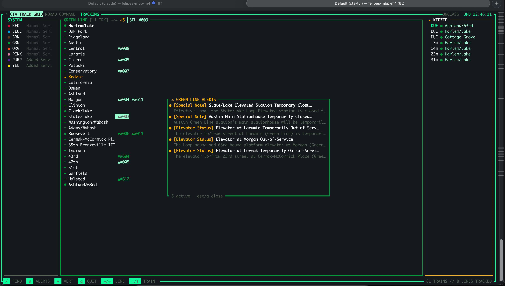

# CTA Track Grid — TUI

NORAD-style Chicago 'L' board in the terminal. Native Rust + [ratatui].  
No Worker proxy needed (native app => no CORS); the API key lives in an env var.



## Features

- **Real-time train positions** for all 8 CTA 'L' lines (Red, Blue, Brown, Green, Orange, Purple, Pink, Yellow)
- **ASCII track map** with live trains projected onto their line, showing direction and approaching status
- **Per-branch maps** for Green Line (both Ashland/63rd and Cottage Grove termini shown stacked)
- **Home station arrivals panel** with live ETAs and terminal destinations
- **Service alerts overlay** (`a` key) — shows active Customer Alerts for the focused line
- **AI dispatch + intel** (`i` key) — a live DeepSeek "DISPATCH" crawl across the top, plus an INTEL panel with the home-station alerts SITREP and today's event advisory (fed by a background SQLite-cached daemon; see [AI layer](#ai-layer))
- **Approach notifier** — bell + flashing panel when a train is ≤ 6 minutes from your home station
- **Desktop notifications** when a tracked train goes delayed (via native OS notifier)
- **Fuzzy station search** (`/` key) — jump to any station across all 8 lines
- **Vertical/horizontal orientation** (`v` key) — switch between track strip and column view
- **NORAD aesthetics** — classification banner, rotating radar sweep `◜◝◞◟`, live clock, blinking status flags

```
╔ ◜ CTA TRACK GRID NORAD COMMAND  TRACKING ═══════════════════ UNCLASS  UPD 14:32:07 ╗
║┌ SYSTEM ──────────────┐┏ GREEN LINE [11 TRK] ←/→ ━━━━━━━━━━━━━━━┓┌ ★ KEDZIE ────────┐║
║│ ● RED   Normal Ser…  │┃ ↓ #002  1m     → 35th… ▸ Ashland/63rd  ┃│  1m ● Harlem/Lake │║
║│ ● GRN   Normal Ser…  │┃ → #003  1m APP → California ▸ Cottage…  ┃│  8m ● Ashland/63rd│║
║│ ● BLUE  Delays       │┃ ← #008 DUE APP → Clark/Lake ▸ Harlem…  ┃│ 22m ● Harlem/Lake │║
║└──────────────────────┘┗━━━━━━━━━━━━━━━━━━━━━━━━━━━━━━━━━━━━━━━━┛└──────────────────┘║
╚ q  QUIT   r  RESCAN   ←/→  LINE   ↑/↓  SCROLL ═════════════ 87 TRAINS // 8 LINES TRACKED ╝
```

A double-ruled console: classification banner + rotating radar sweep and a
live clock in the top rule, the key legend + train/line counter in the bottom rule.
The focused line gets a heavy brand-colored frame; APP/DLY flags and any non-normal
system status blink like real annunciators (driven by a 4 fps render tick).

## Run

Get a free key: https://www.transitchicago.com/developers/traintrackerapply/

```sh
CTA_KEY=your_key_here cargo run --release
```

## Download

Prebuilt single binaries are attached to each [release]. They're self-contained
(~2.7 MB, TLS via rustls, station geometry baked in — no runtime files, no
OpenSSL). Pick your platform:

| Platform              | Asset                                          |
|-----------------------|------------------------------------------------|
| macOS (Apple Silicon) | `cta-tui-vX.Y.Z-aarch64-apple-darwin.tar.gz`   |
| macOS (Intel)         | `cta-tui-vX.Y.Z-x86_64-apple-darwin.tar.gz`    |
| Linux (x86_64, static)| `cta-tui-vX.Y.Z-x86_64-unknown-linux-musl.tar.gz`  |
| Linux (ARM64, static) | `cta-tui-vX.Y.Z-aarch64-unknown-linux-musl.tar.gz` |
| Windows (x86_64)      | `cta-tui-vX.Y.Z-x86_64-pc-windows-msvc.zip`    |

**macOS / Linux** — download, verify, extract, run (Apple-Silicon example):

```sh
gh release download --repo felipedbene/cta-tui --pattern '*aarch64-apple-darwin*'
shasum -a 256 -c cta-tui-*-aarch64-apple-darwin.tar.gz.sha256   # verify
tar xzf cta-tui-*-aarch64-apple-darwin.tar.gz
CTA_KEY=your_key_here ./cta-tui
```

No `gh`? Grab it from the [releases page] or with curl:

```sh
curl -fsSL -O https://github.com/felipedbene/cta-tui/releases/latest/download/cta-tui-v0.1.0-aarch64-apple-darwin.tar.gz
```

macOS marks unsigned downloads as quarantined; if Gatekeeper blocks it, clear
the flag once: `xattr -d com.apple.quarantine ./cta-tui` (or right-click → Open).

**Windows** — download the `.zip` from the [releases page], extract `cta-tui.exe`,
then in PowerShell: `$env:CTA_KEY="your_key_here"; .\cta-tui.exe`.

## Build from source

```sh
cargo install --path .        # installs `cta-tui` into ~/.cargo/bin
# or: cargo build --release   # → target/release/cta-tui
```

The `release` profile is LTO + stripped + `panic=abort`. Cross-platform releases
are built by `.github/workflows/release.yml` on each platform's native runner
when a `vX.Y.Z` tag is pushed; `dist/release.sh` packages binaries locally (macOS
universal via `lipo`; Linux/Windows via `cargo-zigbuild`/`cross` when installed).

[release]: https://github.com/felipedbene/cta-tui/releases/latest
[releases page]: https://github.com/felipedbene/cta-tui/releases

## Config (env vars)

| var              | default                          | meaning                         |
|------------------|----------------------------------|---------------------------------|
| `CTA_KEY`        | —                                | Train Tracker key (required)    |
| `CTA_ROUTES`     | `red,blue,brn,g,org,p,pink,y`    | routes to track                 |
| `CTA_HOME_MAPID` | `41070`                          | home station (Kedzie/Green)     |
| `CTA_HOME_NAME`  | `Kedzie`                         | label for the home panel        |
| `CTA_REFRESH`    | `30`                             | seconds between polls           |
| `CTA_ALERT_MIN`  | `6`                              | bell + flash when a home train is ≤ this many min away (`0` disables) |
| `CTA_NOTIFY`     | `1`                              | desktop notification when a tracked train goes delayed (`0` disables) |
| `CTA_NOTIFY_ICON`| `🚇`                             | emoji prefixed to the notification title; or an image path (uses `terminal-notifier -appIcon` if installed) |
| `CTA_VERTICAL`   | `1`                              | start in vertical track orientation (`0` for horizontal); `v` toggles live |
| `CTA_DB`         | `~/.cache/cta-tui/ai.db`         | local SQLite cache the AI daemon writes and the TUI reads |
| `CTA_AI_BASE`    | (production worker)              | base URL the daemon polls for AI text |

## AI layer

A live **DISPATCH** crawl across the top of the console, plus an **INTEL** panel
(`i` to toggle) with the alerts **SITREP** (scoped to your home station) and
today's **EVENT ADVISORY** — all DeepSeek-generated, served by the companion
Cloudflare Worker. A tiny background **daemon** polls those endpoints and caches
the text in local SQLite (`CTA_DB`), so the TUI render loop never blocks on the
network. The daemon is **auto-managed**: running `cta-tui` spawns it detached if
it isn't already running. Run it standalone with `CTA_DAEMON=1 cta-tui` (no
`CTA_KEY` needed — it only talks to the Worker). The dispatch tag flags amber
when the cached line is stale (daemon down / network out).

## Debug modes (no terminal needed)

```sh
CTA_PROBE=1  CTA_KEY=… cargo run    # one snapshot dumped to stdout (data check)
CTA_RENDER=1 CTA_KEY=… cargo run    # draw one frame off-screen and print as text
                                    #   CTA_COLS / CTA_ROWS size the buffer; CTA_INTEL=1 opens the AI panel
CTA_DAEMON=1 cta-tui                # run only the AI cache daemon (no terminal)
```

## Layout

- **left** — system board: the 8 'L' lines + live status (keyless `routes.aspx`).
- **center** — focused line. A **track map** strip on top and the
  train list under it: heading arrow, run #, ETA, DLY (amber) / APP (green)
  flags, next stop, terminal dest. `←/→` cycles lines; `↑/↓` moves the train
  cursor — the selected train is highlighted in the list and on the map, and
  its run # shows in the panel title.
- **right** — home-station arrivals ticker (`ttarrivals.aspx`).

## Track map — `src/track.rs` + `scripts/build_track.mjs`

The center strip is a NORAD-style line diagram: a rail of evenly-spaced station
ticks `┿`, `◆` termini, the home station starred `★` and labeled, and every live
train projected onto it. Travel direction comes from the compass heading dotted
with the local rail tangent: rightward trains ride the upper rail (`▸`/`▶`),
leftward the lower (`◂`/`◀`); a filled arrowhead means approaching.

Geometry is baked at build time by `scripts/build_track.mjs`, which reads the
Worker repo's `public/lines.geojson` (per-route rail polyline) and
`public/ctaData.js` (station names + lat/lon) into `src/track.json`. At runtime
each station and train lat/lon is projected to a 0..1 position along the rail;
positions are then warped into evenly-spaced *station space* so the dense
downtown stretch stays legible.

```sh
node scripts/build_track.mjs ../cta   # regenerate src/track.json from the Worker
```

The rail is drawn in a dimmed brand color with brighter ticks. **Landmark**
stations — major downtown/transfer anchors (Clark/Lake, Roosevelt, Fullerton,
Belmont, Howard, …) — are marked `◈` and labeled (a two-row packer drops any
label that would collide), so the line is navigable between its termini.

Press `/` to **fuzzy-find** any station across all 8 lines; selecting one jumps
to that line and **zooms** the map to a ~9-station window centered on it, with
every station labeled and trains in-window placed (`«`/`»` count the rest).
Press `a` for the focused line's active **service alerts**, or `v` to flip the
track to a **vertical** orientation (line top→bottom, one station per row with
full names and trains as `▲`/`▼` markers — good for tall/narrow terminals).

Branched lines (Green) ship as overlapping geojson features sharing a trunk.
The build script keeps each as a branch and assigns stations by proximity, so
on a tall enough panel the map draws **both** branches stacked (Harlem/Lake ↔
Ashland/63rd and Harlem/Lake ↔ Cottage Grove); the trunk and home star appear
on both, and each train rides its nearest branch. Short panels fall back to the
primary strip. Single-feature lines (Red, Blue, …) draw one strip.

## Data layer (`src/cta.rs`)

Three feeds folded into one `Snapshot` per poll:
- `ttpositions.aspx` — live train positions (key)
- `ttarrivals.aspx`  — arrivals at home station (key)
- `routes.aspx`      — system status (keyless, filtered to the 8 rail lines)

CTA JSON collapses single-element arrays into bare objects; `OneOrMany<T>`
normalizes that everywhere.

---

Built with [ratatui]. Blog post: [The Train Tracker I Built Because I'm That Guy](https://debene.dev/posts/cta-tracker-chicago-trains/)

[ratatui]: https://ratatui.rs
